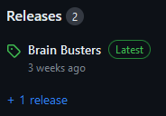
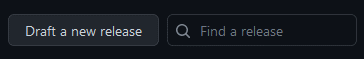
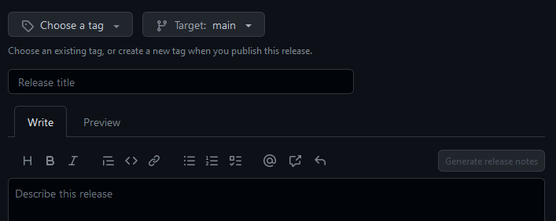
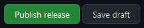

# BrainBusters 

## Table of Content

- [Introduction](#introduction)
- [Built With](#built-with)
- [Main Components](#main-components)
- [Launch](#launch)
- [Deployment](#deployment)
- [Illustrations](#illustrations)
- [Roadmap](#roadmap)
- [Authors & Acknowledgments](#authors--acknowledgments)
- [License](#license)

## Introduction

Brain Busters is a trivia game designed to entertain and educate players on a wide range of topics, from history and geography to pop culture and sports. It provides a solution to the problem of limited entertainment and educational options for people seeking to learn, have fun, connect with others, and maybe even discover new interests.

The game stands out for its various game modes. The classic trivia game offers a traditional style of gameplay, while the image mode gradually reveals blurry pictures. Both modes challenge players on quick decision-making. The facts are accessed and updated using an API, keeping the game up-to-date and accurate.

Next to the single mode, the tournament mode adds an exciting element of competition, allowing players to participate in a bracket-style tournament, creating a more dynamic and engaging experience, as players can track their progress and compete for the ultimate title of Brain Busters champion.

## Built With

* [React](https://react.dev/) - Front-end JavaScript library concerning the user interface
* [Spring](https://spring.io/projects/spring-framework) - Framework that enables running JVM
* [Gradle](hhttps://gradle.org/) - Build automation tool
* [STOMP](https://stomp-js.github.io/stomp-websocket/) - Used for Websockets
* [The Trivia API](https://the-trivia-api.com/) - API for text questions
* [Mailjet API](https://www.mailjet.com/) - For sending mails

## Main Components

### Home
The [Home](https://github.com/sopra-fs23-group-10/sopra-fs23-group-10-client/blob/main/src/components/views/Home.js) file handles the start-up of the game and thus welcomes the user. Due to this reason it has to be very thought out and have in particular a very good design. Additionally, it is connected to the ReceiveInvitation file since an invitation gets you into a game.

### ReceiveInvitation
The [ReceiveInvitation](https://github.com/sopra-fs23-group-10/sopra-fs23-group-10-client/blob/main/src/components/views/ReceiveInvitation.js) file handles the invitation mechanism of the application, this is a critical part for being able to play the game in duel mode. Additionally, it is supplementing the ChallengePlayer file.

### ChallengePlayer
The [ChallengePlayer](https://github.com/sopra-fs23-group-10/sopra-fs23-group-10-client/blob/main/src/components/views/ChallengePlayer.js) file handles the system of who can be invited thus perfectly supplementing the ReceiveInvitation file.

### GameHeader
The [GameHeader](https://github.com/sopra-fs23-group-10/sopra-fs23-group-10-client/blob/main/src/components/views/GameHeader.js) file handles the actions done by the user in the game in the header compartment. Therefore, it is very crucial.

### GameScreen
The [GameScreen](https://github.com/sopra-fs23-group-10/sopra-fs23-group-10-client/blob/main/src/components/views/GameScreen.js) file draws questions and gets the answers of the user. Therefore, it is very crucial else there the game would not be playable for the users.

## Launch

### Getting Started
These instructions will get you a copy of the project up and running on your local machine for development and testing purposes. See [deployment](#deployment) for notes on how to deploy the project on a live system.

Clone the client-repository onto your local machine with the help of [Git](https://git-scm.com/downloads).

```git clone https://github.com/sopra-fs23-group-10/sopra-fs23-group-10-client.git```

### Prerequisites and Installation
For your local development environment, you will need Node.js. You can download it [here](https://nodejs.org). After downloading Node.js we have to install all other dependencies, including React, will get installed with the following command. Please run the command before starting the application for the first time.

```npm install```

If you want to see your development, run the following command:

```npm run dev```

Now [http://localhost:3000](http://localhost:3000) gets opened in a new browser tap, and you see your application. Do not forget to start the server for full functionality.

#### Build
To build the app for production to the `build` folder and get the best performance.<br>
Run:<br>

```npm run build```

## Deployment

Once your changes are pushed onto the main branch, they automatically get deployed onto Google Cloud.

### Create Releases
1. Navigate to the main page of the repository and click on the right of the page on "Releases".<br>

2. On the new page click on "Draft a new release".<br>

3. Choose an appropriate tag with the dropdown menu or create a new one.
4. Choose the appropriate branch that you want to release (main branch).
5. Write an appropriate title for the release in the "Release title" field.
6. Write an appropriate description in the "Describe this release" field or click on "Generate release notes" to autogenerate the description.<br>

7. If everything is correct and can be released, press the button at the bottom "Publish release".<br>


## Illustrations

In the following picture one can see our user journey, which helped us define the right user stories in order to guide the user and create an optimal gaming experience.<br>


First step in BrainBusters is to create an account<br>


or to login<br>


In the next step click on the Start Game button<br>


choose your desired quiz type<br>


and choose your desired mode type<br>


if duel mode has been chosen, you can challenge players or get a random opponent<br>


have fun with BrainBusters!<br>


after the game create a rematch or exit the current game<br>


## Roadmap

Features that new developers who want to contribute to our project could add.

- new Game mode music quiz<br>
- convert to iOS & Android native app
- add new records to our image database

## Authors & Acknowledgments

### Authors
* **Sarah Egger** - *Initial work* - [saeie07](https://github.com/saeie07)
* **Linn Spitz** - *Initial work* - [ringdinglinn](https://github.com/ringdinglinn)
* **Patrick Widmer** - *Initial work* - [Chopstew](https://github.com/Chopstew)
* **Sandrin Hunkeler** - *Initial work* - [Altishofer](https://github.com/Altishofer)
* **Cédric Lüchinger** - *Initial work* - [dattes](https://github.com/dattes)

### Acknowledgments
We would like to thank our tutor [jemaie](https://github.com/jemaie) and the whole team of the module Software Engineering Lab from the University of Zurich.

## License

This project is licensed under the Apache License 2.0 - see the [LICENSE](https://github.com/sopra-fs23-group-10/sopra-fs23-group-10-client/blob/main/LICENSE) file for details.
