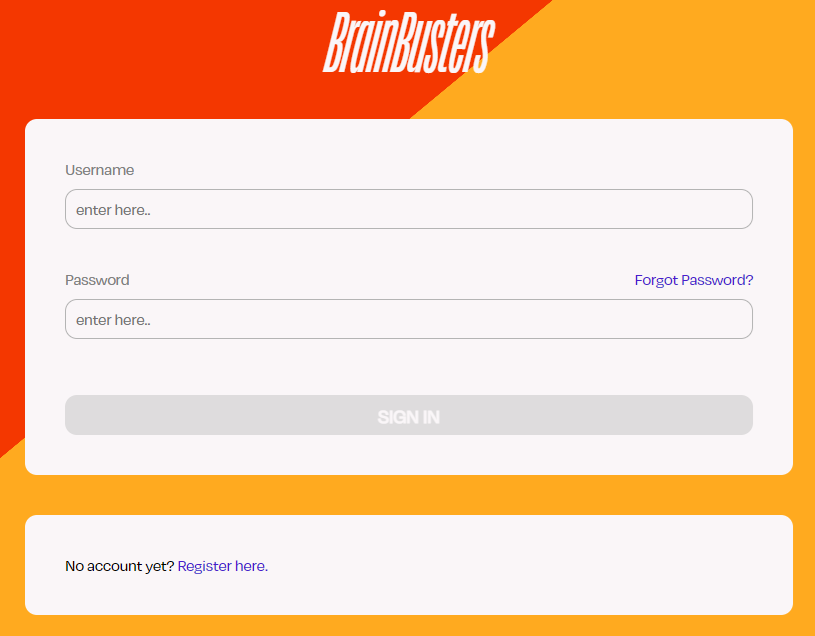

## Table of Content

- [Introduction](#introduction)
- [Built With](#built-with)
- [Main Components](#main-components)
- [Launch](#launch)
- [Deployment](#deployment)
- [Illustrations](#illustrations)
- [Roadmap](#roadmap)
- [Authors & Acknowledgments](#authors--acknowledgments)
- [License](#license)

## Introduction

Brain Busters is a trivia game designed to entertain and educate players on a wide range of topics, from history and geography to pop culture and sports. It provides a solution to the problem of limited entertainment and educational options for people seeking to learn, have fun, connect with others, and maybe even discover new interests.

The game stands out for its various game modes. The classic trivia game offers a traditional style of gameplay, while the image mode gradually reveals blurry pictures. Both modes challenge players on quick decision-making. The facts are accessed and updated using an API, keeping the game up-to-date and accurate.

Next to the single mode, the duel mode adds an exciting element of competition, allowing players to challenge other users, creating a more dynamic and engaging experience, as players can track their progress and compete for the ultimate title of Brain Busters champion.

## Built With

* [React](https://react.dev/) - Front-end JavaScript library
* [NPM](https://www.npmjs.com/) - Build automation tool
* [STOMP](https://stomp-js.github.io/stomp-websocket/) - Bidirectional real time communication

## Main Components

#### Home
The [Home](https://github.com/sopra-fs23-group-10/sopra-fs23-group-10-client/blob/main/src/components/views/Home.js) file handles the start-up of a game and guides the user to the start of a game. This entails the logic of the game and player modes and handling of the users, which makes it connected to the ReceiveInvitation/ChallengePlayer component.

#### ReceiveInvitation
The [ReceiveInvitation](https://github.com/sopra-fs23-group-10/sopra-fs23-group-10-client/blob/main/src/components/views/ReceiveInvitation.js) file handles the invitation mechanism of the application, this is a critical part of being able to play the game in duel mode. Additionally, it supplements the ChallengePlayer file.

#### ChallengePlayer
The [ChallengePlayer](https://github.com/sopra-fs23-group-10/sopra-fs23-group-10-client/blob/main/src/components/views/ChallengePlayer.js) file handles the system of who can be invited. A crucial point to mention is that online users already in a game, cannot be invited.

#### GameHeader
The [GameHeader](https://github.com/sopra-fs23-group-10/sopra-fs23-group-10-client/blob/main/src/components/views/GameHeader.js) file lets the user know important information such as the state of the game (Single vs. Duel, Trivia vs. Image Mode) as well as the number of questions asked. In addition, it handles an important aspect of the game logic, which is the "Cancel Game" function. Any user has to option of cancelling a game at any point in time. 

#### GameScreen
The [GameScreen](https://github.com/sopra-fs23-group-10/sopra-fs23-group-10-client/blob/main/src/components/views/GameScreen.js) file contains a large amount of the game logic and sequence. It draws questions and gets the answers of both the trivia and image mode to the user. In addition, there is a large logic in terms of timers, which benefits the user experience immensely. 

## Deploy Locally with NPM
These instructions will get you a copy of the project up and running on your local machine for development and testing purposes. See [deployment](#deployment) for notes on how to deploy the project on a live system.
#### Clone Repository
Clone the client-repository onto your local machine with the help of [Git](https://git-scm.com/downloads).
```bash 
git clone https://github.com/sopra-fs23-group-10/sopra-fs23-group-10-client.git
```

#### Prerequisites and Installation
For your local development environment, you will need Node.js. You can download it [here](https://nodejs.org).

#### Instal Dependencies
```bash 
npm install
```

#### Run
Client should be up and running on `localhost:3000`.
```bash 
npm run dev
```

#### Create Production Build
```bash 
npm run build
```

## Deployment

- the main branch is automatically mirrored onto Google Cloud App Engine via GitHub workflow
- Google SQL PostgreSQL instance is hosted on Google Cloud
- Credentials for Google App Engine and SQL instances are replaced with GitHub Secrets

### Create Releases
- [follow GitHub documentation](https://docs.github.com/en/repositories/releasing-projects-on-github/managing-releases-in-a-repository)

## Illustrations

#### User Journey


#### Register Screen


#### Login Screen


#### Start Game


#### Quiz Type


#### Gamemode


#### Challenge Player


#### In-Game


#### End Game


## Roadmap

Features that new developers who want to contribute to our project could add.

- new Game mode music quiz.<br>
- convert to iOS & Android native app
- increase responsiveness for mobile browsers
- add new records to our image database

## Authors & Acknowledgments

### Authors
* **Sarah Egger** - *Frontend* - [saeie07](https://github.com/saeie07)
* **Linn Spitz** - *Frontend* - [ringdinglinn](https://github.com/ringdinglinn)
* **Patrick Widmer** - *Backend* - [Chopstew](https://github.com/Chopstew)
* **Sandrin Hunkeler** - *Backend* - [Altishofer](https://github.com/Altishofer)
* **Cédric Lüchinger** - *Backend* - [dattes](https://github.com/dattes)

### Acknowledgments
We would like to thank our tutor [jemaie](https://github.com/jemaie) and the whole team of the module Software Engineering Lab from the University of Zurich.

## License

This project is licensed under the Apache License 2.0 - see the [LICENSE](https://github.com/sopra-fs23-group-10/sopra-fs23-group-10-client/blob/main/LICENSE) file for details.
